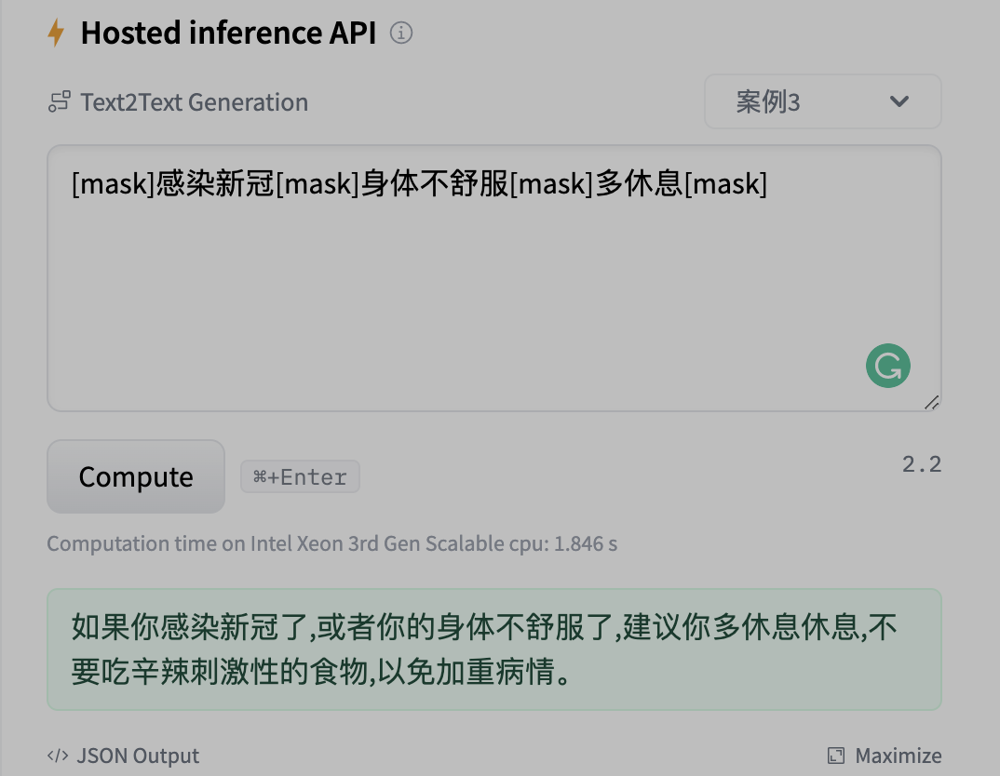
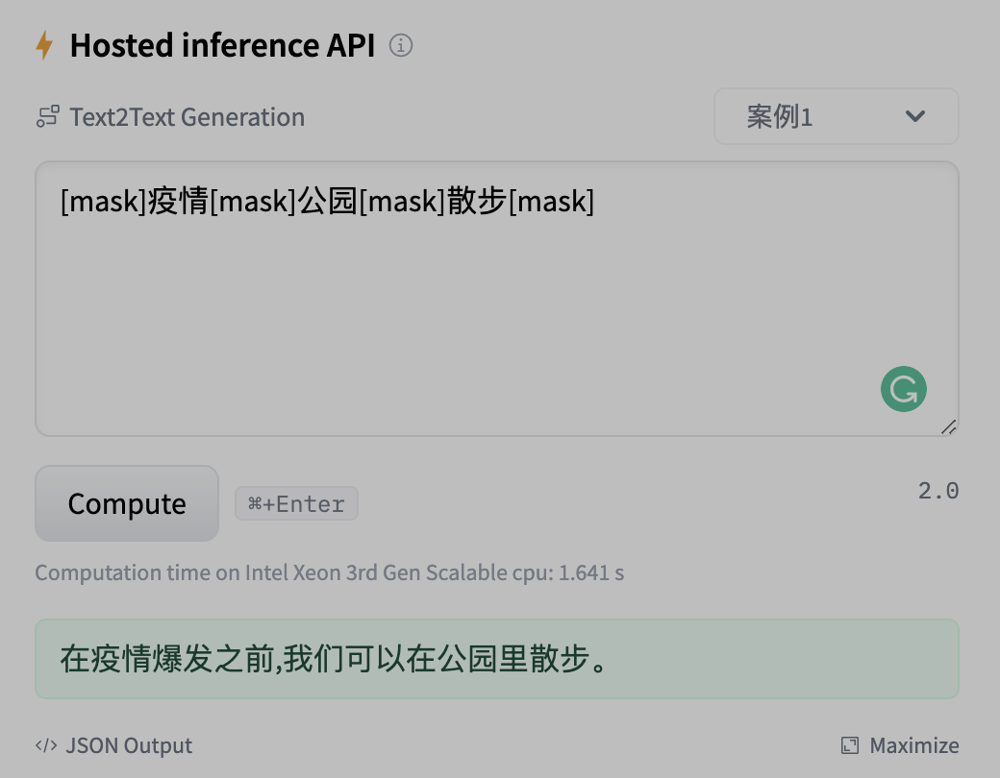
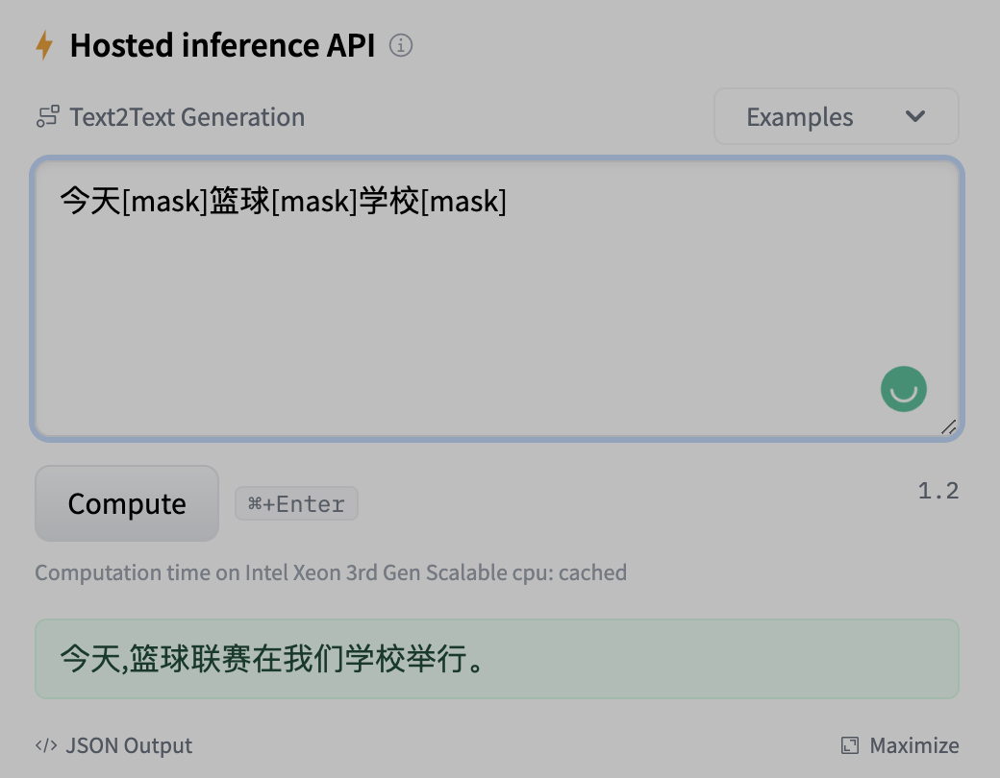

# T5_Mask_Completion
#### 模型功能与结构

1. 该模型功能主要是针对mask部分进行补全填充，产生更加流利丰富的自然语言文本。

2. 模型结构使用T5语言模型结构，输入为带mask符号的语言文本（由原始句子提取主要成分后，遮盖其余文本内容，具体可参考processor目录下脚本），输出为原始句子。

   


#### 如何使用

```python
from transformers import AutoTokenizer, AutoModelForSeq2SeqLM
pretrained = "Maciel/T5_Mask_Completion"
tokenizer = AutoTokenizer.from_pretrained(pretrained)
model = AutoModelForSeq2SeqLM.from_pretrained(pretrained)

sentence = "[mask]疫情[mask]公园[mask]散步[mask]"
max_input_length = 128
input_encodings = tokenizer(sentence, 
                            max_length=max_input_length, 
                            truncation=True, 
                            return_tensors="pt")
if "token_type_ids" in input_encodings.keys():
    input_encodings.pop("token_type_ids")
output = model.generate(**input_encodings, 
                        num_beams=10,
                        no_repeat_ngram_size=5,
                        do_sample=True, 
                        early_stopping=True,
                        min_length=10,
                        max_length=64,
                        return_dict_in_generate=True,
                        output_scores=True)
decoded_output = tokenizer.batch_decode(output.sequences, skip_special_tokens=True)[0]
completion = decoded_output.strip()
print(completion)
```

我们在huggingface上提供了下载链接和体验接口：

| 模型                                                         | 支持语言 | 备注                         |
| :----------------------------------------------------------- | :------- | :--------------------------- |
| [T5_Mask_Completion](https://huggingface.co/Maciel/T5_Mask_Completion) | 中文     | 在四千万中文语料上进行预训练 |


#### 案例展示

<p float='left'>
    
</p>


#### 继续训练

1. 如果你想在自己的领域语料上继续预训练，那首先使用processor目录下的process_data脚本处理你的语料，获取带mask的输入文本和完整的输出文本对。
2. 其次可以从我们提供的模型进行继续预训练（使用train_t5_completion脚本），也可以从原始的孟子T5语言模型继续预训练（使用train_mengzi_t5脚本），其中区别就是原始词表中是否包含[mask]词。


#### 参考文献

1. https://github.com/beyondguo/genius
2. https://huggingface.co/beyond/genius-base-chinese
